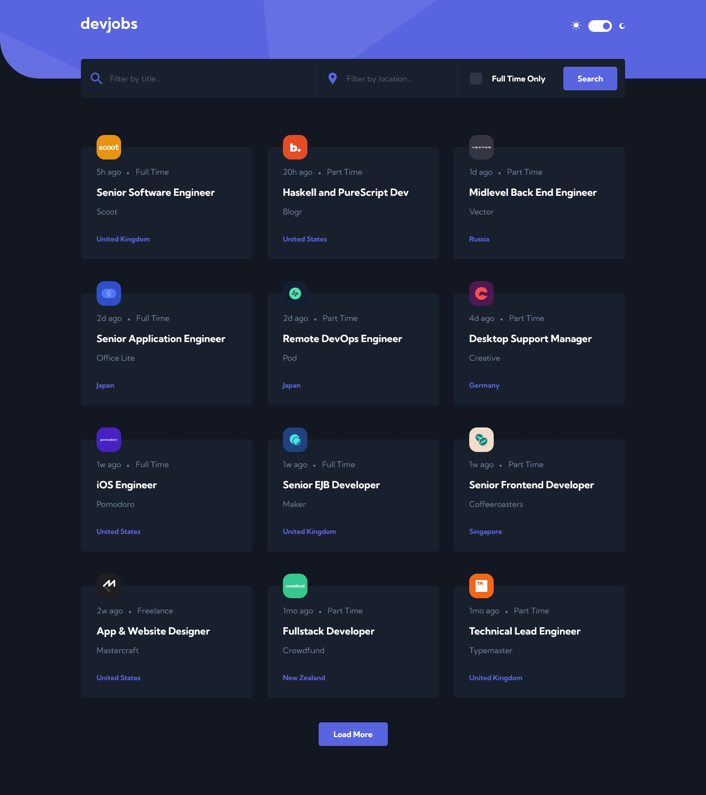

## Table of contents

- [Overview](#overview)
  - [The challenge](#the-challenge)
  - [Screenshot](#screenshot)
  - [Links](#links)
- [My process](#my-process)
  - [Built with](#built-with)
- [Author](#author)

## Overview

### The challenge

Users should be able to:

- View the optimal layout for each page depending on their device's screen size
- See hover states for all interactive elements throughout the site
- Be able to filter jobs on the index page by title, location, and whether a job is for a full-time position
- Be able to click a job from the index page so that they can read more information and apply for the job
- Have the correct color scheme chosen for them based on their computer preferences.

### Screenshot

### Links

- Solution URL: [Frontend Mentor](https://www.frontendmentor.io/solutions/dev-jobs-app-with-vue-mDIqEMZkJ)
- Live Site URL: [GitHub Pages](https://untalpeluca.github.io/DevJobsApp/)

## My process

### Built with

- Semantic HTML5 markup
- CSS custom properties
- Flexbox
- Mobile-first workflow
- Vue 3

## Author

- Frontend Mentor - [@UnTalPeluca](https://www.frontendmentor.io/profile/untalpeluca)
